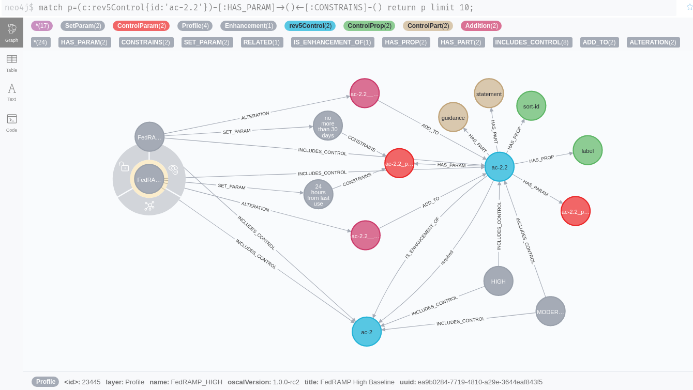
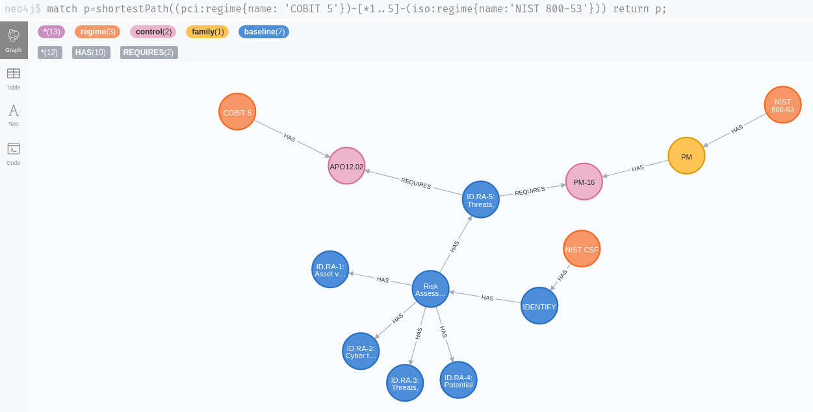
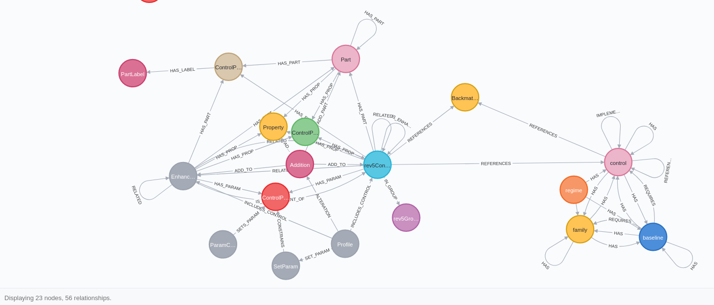

# Comply-22

Comply-22 is a graph-based compliance engine. 

It uses Neo4J to map relationships between different information security regulations, legislation and best practices. A REST API can be used to query the mapping information.

Comply-22 can also be used to document the application, implementation and assessment of security controls over time.

## Engine / REST API

The first version is currently being developed.

## Data

Comply-22 includes some datasets based on publicly available sources. You will need the APOC library to scrape them directly from Github into the database. There
is no need to download the files first.

## OSCAL: NIST 800-53 rev5 

In the data directory you will find a set of Neo4J cypher commands. They will scrape the [OSCAL](https://github.com/usnistgov/OSCAL) representation 
of the [NIST 800-53](https://github.com/usnistgov/oscal-content) catalog layer directly from Github 
into the Neo4J database.

There are also scripts to scrape the [profile layer](https://pages.nist.gov/OSCAL/documentation/schema/) (LOW, MEDIUM, HIGH and PRIVACY profiles). These will be linked to the catalog layer nodes so make sure to import these first.

### **Examples:**

### *The control 'AC-2' with its enhancements and parts:*

### *Relations between controls:*

### *Tabular output: which controls are most required by other controls:*

### *Example: referenced backmatter:*

### *A withdrawn control (the loop on sc-12 was confirmed by @usnistgov to [probably be an error in the FISMA source](https://github.com/usnistgov/oscal-content/issues/72)):*

## OSCAL: FedRAMP profiles (rev4)

These scripts will scrape the [FedRAMP](https://github.com/GSA/fedramp-automation) profiles (LOW, MEDIUM, HIGH) form the Github repository directly into Neo4J. They will be linked to the previously imported 800-53 controls and control enhancements
so make sure that you have imported them first.

### *Example: a FedRAMP profile can constrain control parameters to specific values*

Here a time range parameter of control enhancement AV-2.2 is constrained to a value of "24 hours from last use". 

This applies to the second parameter of this statement: "Automatically {{ remove / disable }} temporary and emergency accounts after {{ organization-defined time period for each type of account }}.

### *A FedRAMP profile can add parameters and parts to controls*

Here: additional requirements and guidance are added to control RA-5.6:

### The FedRAMP 'HIGH' profile puts more strict constraints on control parameters than the FedRAMP 'MODERATE' profile:

## Other sources

There are other publicly available Neo4J databases that can be included as well, such as the graph from the [SCKG](https://gitlab.com/redteam-project/sckg) project.

SCKG doesn't model all of the standards in the greatest depth (i.e. control enhancements, properties, parts won't be differentiated for 800-53) but it makes up for that by including a lot of standards.

### *Compliance Mapping: a connection from PCI DSS to ISO/IEC 27001:2013 was found by the "shortestPath" algorithm using a NIST CSF control as an intermediary*

This is accomplished by using the [SCKG](https://gitlab.com/redteam-project/sckg) graph.

We can deduce that there is an analogy between the ISO 27001 control A.14.2.8 ("System Security Testing") and the PCI DSS controls 11.4 ("Use intrusion detection and prevention") and 11.5 ("Deploy a change detection mechanism"):

### *SCKG: A shortest-path connection between Cobit 5 APO-012.02 ("Analyse risk") and NIST 800-53rev4 PM-16 ("Treat awareness program") , again using a NIST CSF control as an intermediary*

## German BSI IT-Baseline Catalog

These scripts import a JSON representation of the German [IT-Baseline catalog](https://www.bsi.bund.de/EN/Topics/ITGrundschutz/itgrundschutz_node.html) ("IT-Grundschutz-Kompendium") into Neo4J. A script is provided to
convert an XML version of the catalog into a JSON format suitable for importing with APOC.

The source XML file that was used can be found as part of the [verinice](https://github.com/SerNet/verinice) project

### *Connections from modules ("Bausteine") to Safeguards ("Umsetzungshinweise")':*

### *Which threats are referenced by the most safeguards:*

## Schema Visualization

The complete database schema currently looks as follows (this includes nodes from [SCKG](https://gitlab.com/redteam-project/sckg), see above):

