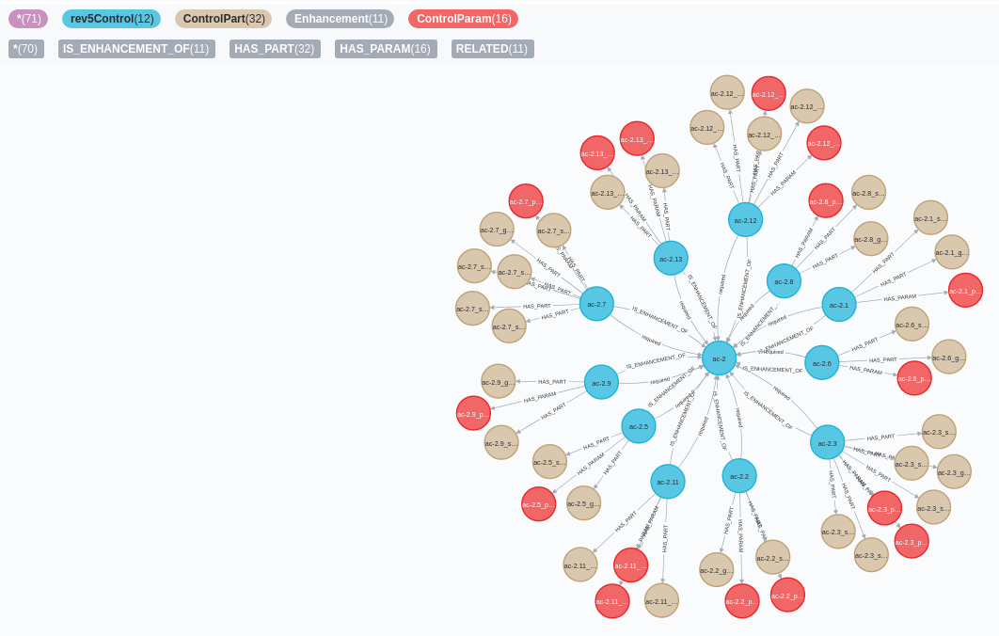
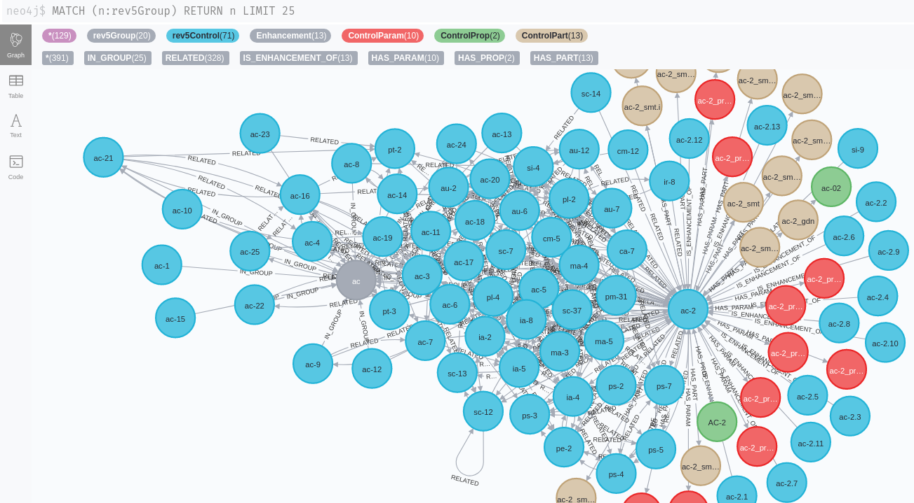
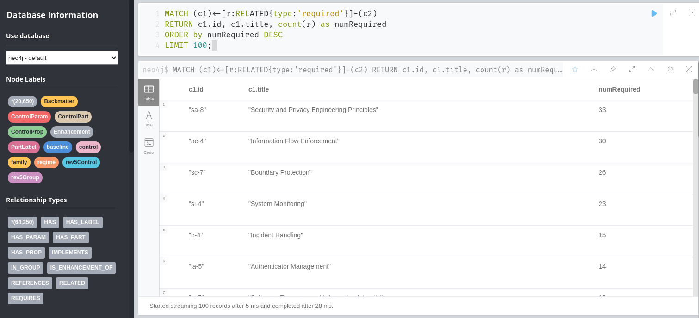
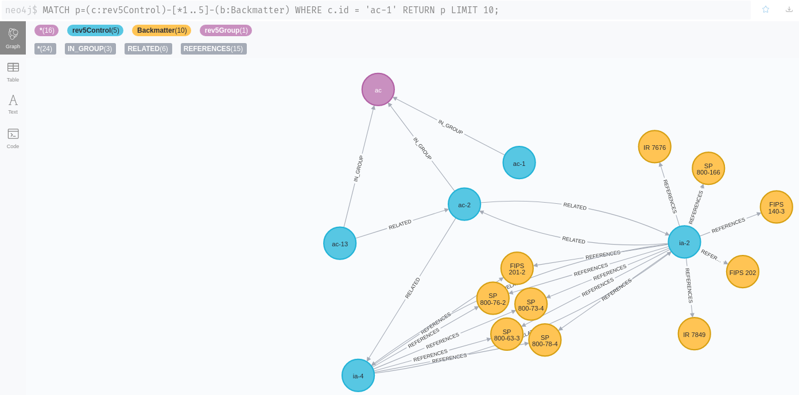
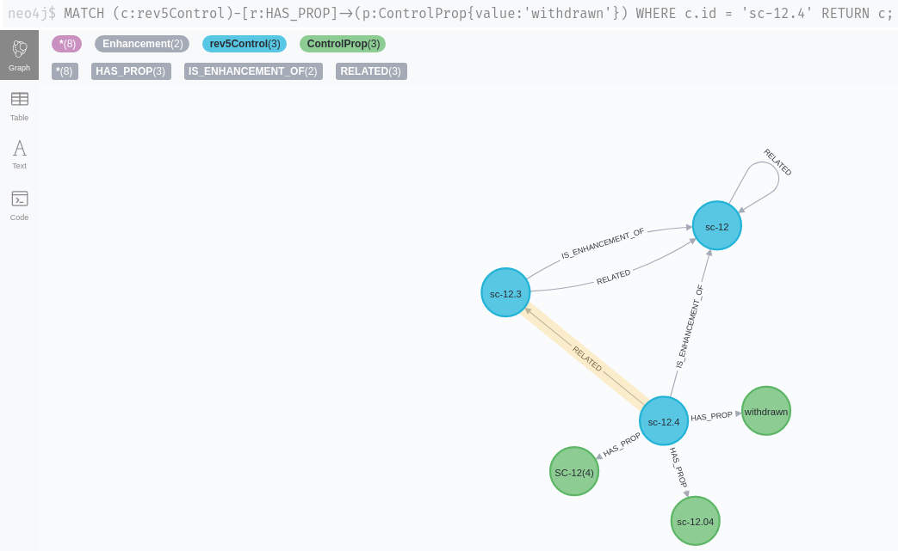
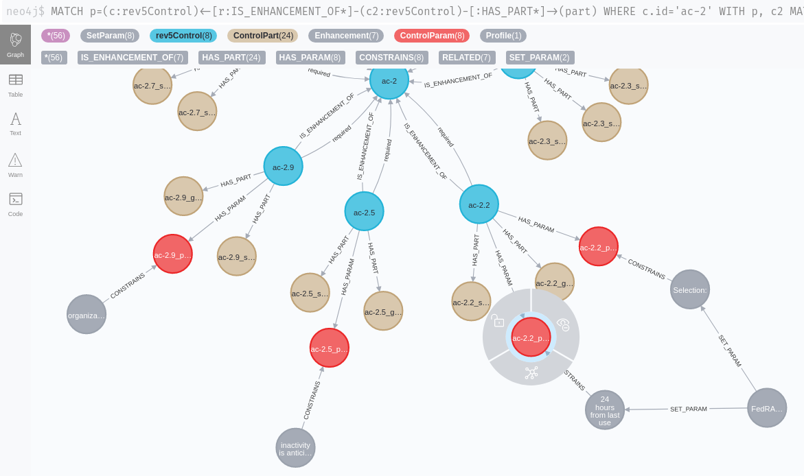
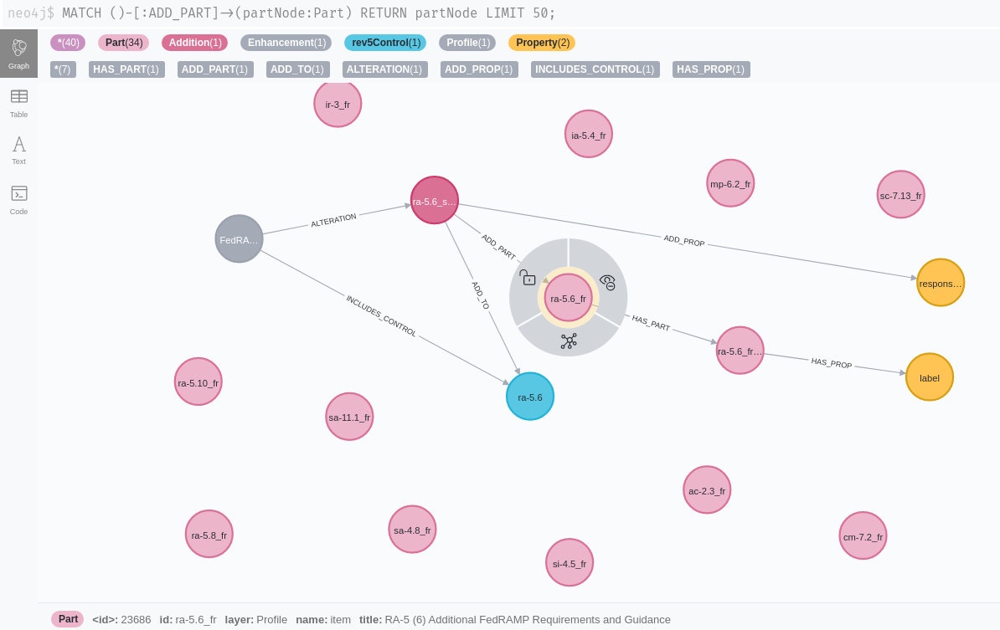
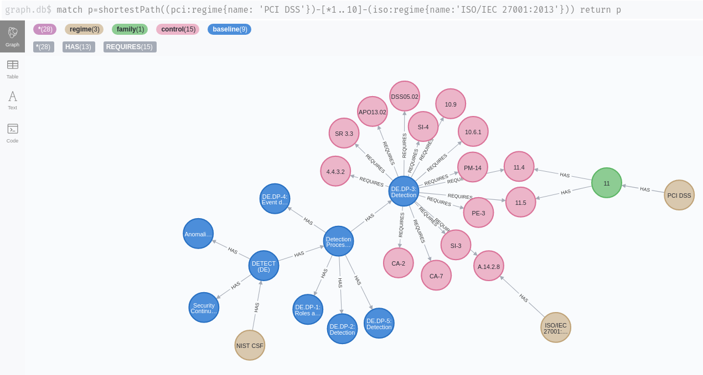
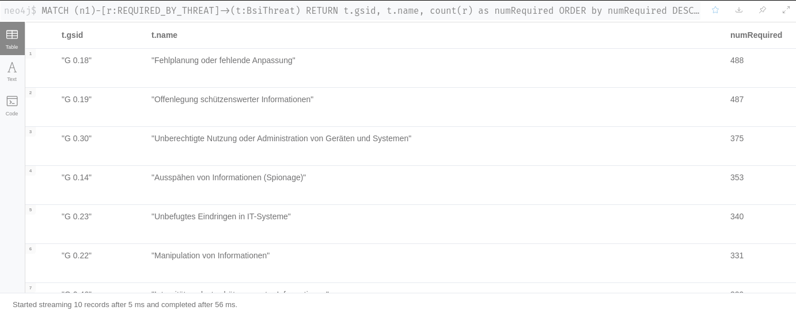

# Comply-22

Comply-22 is a graph-based compliance engine. 

It uses Neo4J to map different information security and other standards to each other over multiple hops. Neo4J is uniquely suited for this task.

Comply-22 can also be used to document the application, implementation and assessment of controls over time.

## Engine / REST API

The first version is currently being developed.

## Data

Comply-22 includes some datasets based on publicly available sources. You will need the APOC library to scrape them directly from Github into the database. There
is no need to download the files first.

## OSCAL: NIST 800-53 rev5 

In the data directory you will find a set of Neo4J cypher commands. They will scrape the [OSCAL](https://github.com/usnistgov/OSCAL) representation 
of the [NIST 800-53](https://github.com/usnistgov/oscal-content) catalog layer directly from Github 
into the Neo4J database.

There are also scripts to scrape the [profile layer](https://pages.nist.gov/OSCAL/documentation/schema/) (LOW, MEDIUM, HIGH and PRIVACY profiles). These will be linked to the catalog layer nodes so make sure to import these first.

### **Examples:**

### *Control AC-2 with enhancements and parts:*

### *Relations between controls:*

### *Tabular output: controls most required by other controls:*

### *Example: referenced backmatter:*

### *A withdrawn control (the loop on sc-12 was confirmed by @usnistgov to [probably be an error in the FISMA source](https://github.com/usnistgov/oscal-content/issues/72)*):

## OSCAL: FedRAMP profiles

These scripts will scrape the [FedRAMP](https://github.com/GSA/fedramp-automation) profiles (LOW, MEDIUM, HIGH) form the Github repository directly into Neo4J. They will be linked to the previously imported 800-53 controls and control enhancements
so make sure that you have imported them first.

### *A FedRAMP profile can constrain control parameters to specific values*
Here a time range parameter of control enhancement AV-2.2 is constrained to a value of "24 hours from last use". 

This applies to the second parameter of this statement: "Automatically {{ remove / disable }} temporary and emergency accounts after {{ organization-defined time period for each type of account }}.

### *A FedRAMP profile can add parameters and parts to controls*

Here: additional requirements and guidance are added to control RA-5.6:

## Other sources

There are other publicly available Neo4J databases that can be included as well, such as the graph from the [SCKG](https://gitlab.com/redteam-project/sckg) project.

SCKG doesn't model all of the standards in the greatest depth (i.e. control enhancements, properties, parts won't be differentiated for 800-53) but it makes up for that by including a lot of standards.

### *SCKG Example: a connection from PCI DSS to ISO/IEC 27001:2013 found by the "shortestPath" algorithm using a NIST CSF control as an intermediary*

## German BSI IT-Baseline Catalog

These scripts import a JSON representation of the German [IT-Baseline catalog](https://www.bsi.bund.de/EN/Topics/ITGrundschutz/itgrundschutz_node.html) ("IT-Grundschutz-Kompendium") into Neo4J. A script is provided to
convert an XML version of the catalog into a JSON format suitable for importing with APOC.

The required source XML file can be found as part of the [verinice](https://github.com/SerNet/verinice) project

### *Connections from modules ("Bausteine") to Safeguards ("Umsetzungshinweise")':*

### *Which threats are referenced by the most safeguards:*
